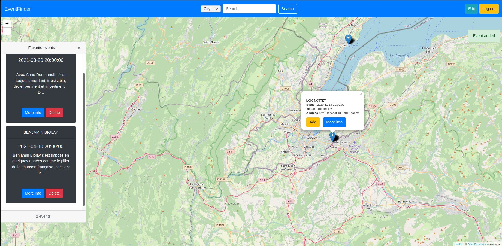

# EventFinder

**Directed by**: Maxime Hutinet, Justin Foltz

**Date:** 12.2019

## Project's description

EventFinder is a web application allowing users to find events (concert, festival) anywhere in the world. Users can quickly view a summary of an event, access its website for more information and add to their personal list to keep track of it. It is possible to view the list of all his friends in order to complete his own or to organize appointments.



## Functionalities

\* Visualization of concert/festival, symbolized by markers on a map;

\* Visualization of event details by clicking on a marker;

\* Access to event website from event details;

\* Save/delete an event in its profile;

\* Viewing one's profile and the profiles of other users;

\* Adding events to one's profile from someone else's profile;

\* Search for users and locations.

## Technologies

- API REST and HTTP server : Express.JS, jsonwebtoken, mongoose;
- Website : HTML/CSS, JavaScript/JQuery, Bootstrap;
- Database : MongoDB;
- External API : Eventful (provides events), Leaflet (provides the map).

## Running the project

**Requirements :** Docker and Docker-compose must be installed.

1. Clone the repository;

2. In project root folder, run the below command : 

   ```bash
   docker-compose up -d
   ```

3. navigate to `localhost` or `127.0.0.1`

## Project's configuration

Environment variables and secrets are stored in the `.env` file in the root directory. It is at least necessary to obtain an Eventful API key ([EventFul API key](https://api.eventful.com/keys)) and added to the following field :

```
APIKEY=<your api key>
```

## API Routes

Notre API dispose des routes suivantes :

```javascript
GET /register
```
Envoi fichier du *register.html*.

```bash
POST /register
```
Ajoute un utilisateur au site. Le champ `id` doit être unique dans toute la base de donnée.

Paramètres :

| Nom   | Type  | Description  |
|---|---|---|
| username | String  | ID de l'utilisateur  |
| name  | String  | Nom de l'utilisateur  |
| pass  | String  | Mot de passe de l'utilisateur  |

```bash
GET /login
```
Envoi du fichier *login.html*.

```bash
POST /login
```
Vérifie si un utilisateur a le droit de ce connecter à l'application. Si oui, un token est créé et renvoyé à l'utilisateur pour maintenir sa session.

Paramètres :

| Nom   | Type  | Description  |
|---|---|---|
| username | String  | ID de l'utilisateur  |
| pass  | String  | Mot de passe de l'utilisateur  |

```bash
GET /logout
```
Deconecte l'utilisateur en supprimant son token JWT.

```bash
GET /map
```
Envoi du fichier *map.html*.

```bash
GET /profil
```
Retourne l'ID et le nom de l'utilisateur courant.

Paramètres :

| Nom   | Type  | Description  |
|---|---|---|
| username | String  | ID de l'utilisateur  |
| name  | String  | Nom de l'utilisateur  |


```bash
GET /profil/favorite
```
Retourne une liste des évènements favoris de l'utilisateur courant.

```bash
POST /profil/event/:eventID
```
Ajoute un évènement à la liste des favoris de l'utilisateur courant.

Paramètres :

| Nom   | Type  | Description  |
|---|---|---|
| eventID  | String  | ID de l'évènements |

```bash
DELETE /profil/event/:eventID
```
Supprime un évènement de la liste des favoris de l'utilisateur courant.

Paramètres :

| Nom   | Type  | Description  |
|---|---|---|
| eventID  | String  | ID de l'évènements |

```bash
GET /event/:latitude/:longitude/:radius
```
Retourne une liste d'évènements

Paramètres :

| Nom   | Type  | Description  |
|---|---|---|
| latitude  | String  | latitude du lieu |
| longitude  | String  | longitude du lieu |
| radius  | String  | rayon dans lequel chercher (en KM) |

```bash
GET /profil/names/:name
```
Retourne une liste de profil utilisateur matchant un mot clé

Paramètres :

| Nom   | Type  | Description  |
|---|---|---|
| name  | String  | Utilisateur recherché |

```bash
GET /profil/:name
```
Retourne le profil de l'utilisateur matchant un mot clé

Paramètres :

| Nom   | Type  | Description  |
|---|---|---|
| name  | String  | Utilisateur recherché |

```bash
POST /profil/edit/check
```
Vérifie si un ID d'utilisateur est libre.

Paramètres :

| Nom   | Type  | Description  |
|---|---|---|
| username  | String  | ID d'Utilisateur à vérifier |

```bash
POST /profil/edit/activate
```
Vérifie le mot de passe de l'utilisateur courant afin d'activer l'édition de son mot de passe.

Paramètres :

| Nom   | Type  | Description  |
|---|---|---|
| pass  | String  | Mot de passe du l'utilisateur |

```bash
POST /profil/edit
```
Applique les modifications de profil demandées par l'utilisateur.

Paramètres :

| Nom   | Type  | Description  |
|---|---|---|
| username  | String  | ID de l'utilisateur |
| name  | String  | Nom de l'utilisateur |
| pass  | String  | Mot de passe de l'utilisateur |
